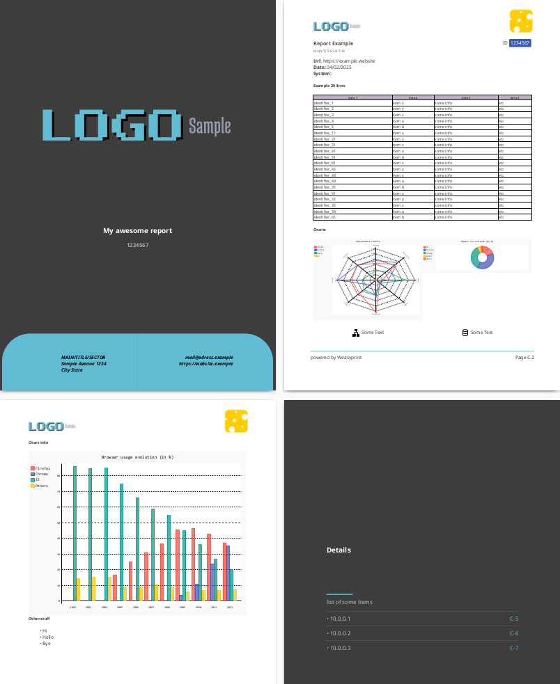
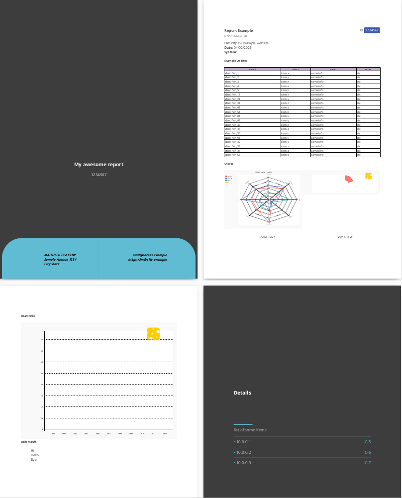

### DEMO BUG Weasyprint V64
<div style="background-color:#ffeeaa; padding:20px; margin:0px auto;font-size:20pt;">
 🎉 Fixed in Version 64.1
</div>


- I used  sample report from <https://weasyprint.org/> as the basis for this template
- To simulate this bug, use Linux (Ubuntun, Debian, Fedora etc.)
- install UV to manage venv: <https://docs.astral.sh/uv/>
- clone this repo 😊

To simulate:

```bash
cd <dir_project>
uv sync
source .venv/bin/activate
python report_example.py
```

Then, change de **pyproject.toml** to use weasyprint V64 and change the output file name in **report_example.py**

```bash

uv sync
python report_example.py
```
Compare the PDF output 😊


#### OK version


#### with error
